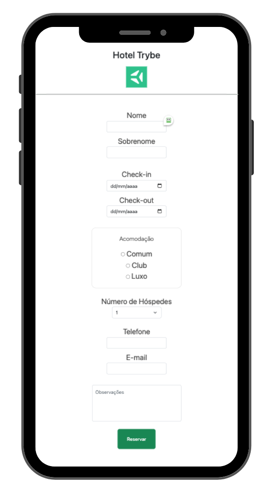

# Dinâmica em duplas - CSS Responsivo

Boas-vindas à nossa segunda dinâmica da Seção 6. Com essa atividade, vocês vão trabalhar em equipes (as mesmas do Projeto Trybewarts), em busca de uma solução da situação proposta. A sugestão é que uma pessoa compartilhe a tela, enquanto as duas (ou três) pessoas trocam ideias e desenvolvam juntas.

## Cenário

A rede Hotel Trybe agradeceu pelos serviços prestados anteriormente! Mas a página precisa de ajustes para melhor visualização em smartphohes. 
*O cliente solicitou que, para aparelhos com largura de até 600px, os requisitos a seguir devem ser cumpridos.*

Assim, a página ficará parecida com a imagem:

Antes de iniciar os trabalhos, uma das pessoas da dupla deverá clonar esse repositório. 
Não será preciso criar branch e nem abrir Pull Request.  

Caso seja de preferência da dupla, é permitido realizar _fork_ (cópia) do repositório do GitHub e depois realizar o clone. 

## Requisitos

1. Todos os campos de input devem ficar em colunas, e não mais lado a lado.
2. Centralize todos os inputs.
3. No item _Acomodação_, faça com que as opções fiquem em colunas, e não mais em linhas.
4. Diminua a largura do campo _Observações_ para 50%.

## Prazo e demais instruções

Teremos 40 minutos direcionados para a dinâmica. 
Caso não seja possível terminar, podem continuar fazendo o trabalho posteriormente. 
